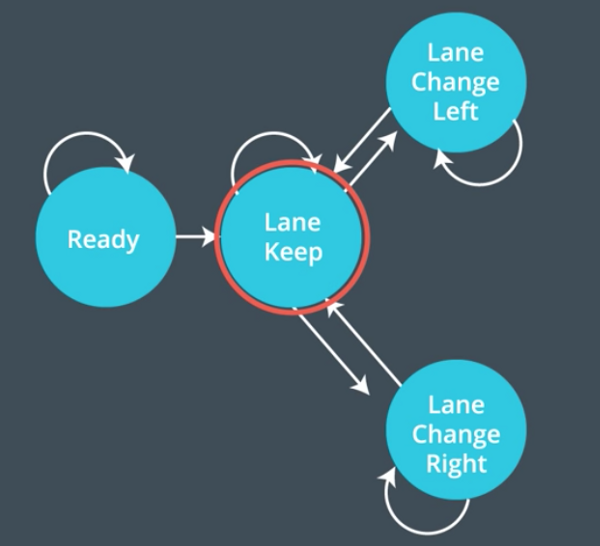

# Path Planning Project for Self-Driving Car

## Goals
The goal of this project is to safely navigate the car around a virtual highway with other vehicles that is driving +-10 MPH of 
the 50 MPH speed limit. <br>
Specifically:
- The car should try to go as close as possible to the 50 MPH speed limit
- The car should pass slower traffic when possible
- The car has to void hitting other cars at all cost 
- The car has to drive inside of the marked road lanes at all times
- The car should be able to make one complete loop around the 6946m highway
- The car should not experience total acceleration over 10 m/s^2 and jerk that is greater than 10 m/s^3.

Given:
- The car's localization
- The sensor fusion data
- The sparse map list of waypoints around the highway. 

## Demostration


The full demonstration is at [https://youtu.be/qpuEvE4Hhxw](https://youtu.be/qpuEvE4Hhxw). <br>
It's shown that my car could drive without accidents on the highway.

## Implementation details
Behaviour Control Overview


### Prediction
The code of this part is from line ```#120``` to line ```#158```. <br>
From the sensor_fusion data, we can predict positions of other cars.
Then if the distance between our car and an another car is less than 30 meters (in front or behind), our car is considered 
in a dangerous area. 

### Behaviour Planning
The code of this part is from line ```#164``` to line ```#189```. <br>
Behaviour planning overview:


In this part, the car need to decide:
- Speed up or slow down
- Should it pass a slower car in front? (Change lane)

I considered only 3 states of the car during driving:
- Keep lane
- Change lane right
- Change lane left



### Trajectory Generation
The code of this part is from line ```#195``` to line ```#310```. <br>
The generated trajectory consists of 50 points in the global cartersian coordinates (x,y).
- I took 2 points that were not processed in the previous trajectory.
- I added 3 more points that are in the Frenet coordinate:
    - _**s**_: 30m, 60m, and 90m from the current position of our car
    - _**d**_: the center of the target lane.
- I used the [spline library](https://kluge.in-chemnitz.de/opensource/spline/) to generate the new trajectory.

### Future work
- [ ] Design cost function for the behaviour planner.
- [ ] Consider ```prepare change lane left/right``` states.

## Input and Output data

### Input: The map of the highway is in data/highway_map.txt
The track contains a total of 181 waypoints with the last waypoint mapping back around to the first. 
The waypoints are in the middle of the double-yellow that divides line in the center of the highway.

Each waypoint in the list contains ```x,y,s,dx,dy``` values.
- **x** and **y** are the waypoint's map coordinate position.
- **s** value is the distance along the road to get to that waypoint in meters.
- **dx** and **dy** values define the unit normal vector pointing outward of the highway loop.
- **d** vector has a magnitude of 1 and points perpendicular to the road in the direction of the right-hand side of the road.

The highway has 6 lanes total - 3 heading in each direction. Each lane is *4m* wide and the car should only ever be in 
one of the 3 lanes on the right-hand side. The car should always be inside a lane unless doing a lane change.

### Main car's localization Data (No Noise) from the Simulator

- **x**: The car's x position in map coordinates

- **y**: The car's y position in map coordinates

- **s**: The car's s position in frenet coordinates

- **d**: The car's d position in frenet coordinates

- **yaw**: The car's yaw angle in the map

- **speed**: The car's speed in MPH

### Previous path data given to the Planner
- **previous_path_x**: The previous list of x points previously given to the simulator

- **previous_path_y**: The previous list of y points previously given to the simulator

### Previous path's end s and d values 

- **end_path_s**: The previous list's last point's frenet s value

- **end_path_d**: The previous list's last point's frenet d value

### Sensor Fusion Data, a list of all other car's attributes on the same side of the road. (No Noise)

- **sensor_fusion**:
    - car's unique ID
    - car's x position in map coordinates
    - car's y position in map coordinates
    - car's x velocity in m/s 
    - car's y velocity in m/s
    - car's s position in frenet coordinates
    - car's d position in frenet coordinates 

## Code Style

[Google's C++ style guide](https://google.github.io/styleguide/cppguide.html).
* indent using spaces
* set tab width to 2 spaces (keeps the matrices in source code aligned)

## Source code structure
The directory structure of this repository is as follows:

```shell script
${ROOT}
├──build.sh
├──clean.sh
├──CMakeLists.txt
├──README.md
├──run.sh
├──data/
    ├──highway_map.csv
├──src/
    ├──helpers.h
    ├──json.hpp
    ├──main.cpp
    ├──spline.h
```

## Dependencies
* cmake >= 3.5
* make >= 4.1
* gcc/g++ >= 5.4
* [uWebSockets](https://github.com/uWebSockets/uWebSockets)

## How to compile and run
1. Download the Term 3 Simulator [here](https://github.com/udacity/self-driving-car-sim/releases/tag/T3_v1.2).
2. Install `uWebSocketIO`: <br>
This repository includes two files that can be used to set up and install [uWebSocketIO](https://github.com/uWebSockets/uWebSockets) 
for either Linux or Mac systems. For windows you can use either Docker, VMware, 
or even [Windows 10 Bash on Ubuntu](https://www.howtogeek.com/249966/how-to-install-and-use-the-linux-bash-shell-on-windows-10/)<br>
You can execute the `install-ubuntu.sh` to install uWebSocketIO.

3. Once the install for uWebSocketIO is complete, the main program can be built and ran by doing the following from the project top directory.

```shell script
mkdir build
cd build
cmake ..
make
./path_planning
```